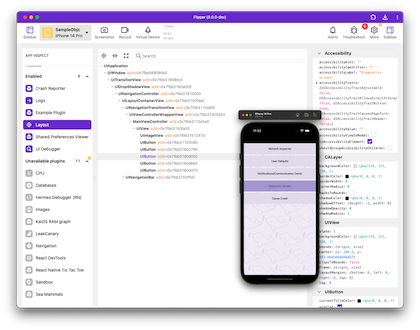

<p align="center">
  
</p>
<h1 align="center">
  Flipper
</h1>
<p align="center">
  <a href="https://search.maven.org/artifact/com.facebook.flipper/flipper">
    
  </a>
  <a href="https://cocoapods.org/pods/Flipper">
    
  </a>
</p>

---
## Important Announcement

Flipper is moving away from its Electron distribution to an in-Browser experience.

**How does this affect me?**

Functionality hasn't changed. The UI remains unchanged. Flipper will run in your default browser instead of a standalone application.
If you build from source, Flipper will open in the browser instead of a standalone app. We also provide a MacOS app for the Flipper runtime which can be run and will also open Flipper in the browser.

The last Electron release is [v0.239.0](https://github.com/facebook/flipper/releases/tag/v0.239.0). As such, future releases will not include Electron artifacts.

### React Native support

If you are debugging React Native applications, [v0.239.0](https://github.com/facebook/flipper/releases/tag/v0.239.0) will be the last release with support for it due to technical limitations for React Dev Tools and Hermes Debugger plugins. As such, please refer to that release when debugging React Native applications.

---

<p align="center">
  Flipper (formerly Sonar) is a platform for debugging mobile apps on iOS and Android and JS apps in your browser or in Node.js. Visualize, inspect, and control your apps from a simple desktop interface. Use Flipper as is or extend it using the plugin API.
</p>



## Table of Contents

- [In this repo](#in-this-repo)
- [Getting started](#getting-started)
  - [Requirements](#requirements)
- [Building from Source](#building-from-source)
  - [Desktop](#desktop)
    - [Running from source](#running-from-source)
    - [Building standalone application](#building-standalone-application)
  - [iOS SDK + Sample App](#ios-sdk--sample-app)
  - [Android SDK + Sample app](#android-sdk--sample-app)
  - [React Native SDK + Sample app](#react-native-sdk--sample-app)
  - [JS SDK + Sample React app](#js-sdk--sample-react-app)
    - [Troubleshooting](#troubleshooting)
- [Documentation](#documentation)
  - [Contributing](#contributing)
  - [License](#license)

## Mobile development

Flipper aims to be your number one companion for mobile app development on iOS
and Android. Therefore, we provide a bunch of useful tools, including a log
viewer, interactive layout inspector, and network inspector.

## Extending Flipper

Flipper is built as a platform. In addition to using the tools already included,
you can create your own plugins to visualize and debug data from your mobile
apps. Flipper takes care of sending data back and forth, calling functions, and
listening for events on the mobile app.

## Contributing to Flipper

Both Flipper's desktop app, native mobile SDKs, JS SDKs are open-source and MIT
licensed. This enables you to see and understand how we are building plugins,
and of course, join the community and help to improve Flipper. We are excited to
see what you will build on this platform.

# In this repo

This repository includes all parts of Flipper. This includes:

- Flipper's desktop app built using [Electron](https://electronjs.org)
  (`/desktop`)
- native Flipper SDKs for iOS (`/iOS`)
- native Flipper SDKs for Android (`/android`)
- React Native Flipper SDK (`/react-native`)
- JS Flipper SDK (`/js`)
- Plugins:
  - Logs (`/desktop/plugins/public/logs`)
  - Layout inspector (`/desktop/plugins/public/layout`)
  - Network inspector (`/desktop/plugins/public/network`)
  - Shared Preferences/NSUserDefaults inspector
    (`/desktop/plugins/public/shared_preferences`)
- website and documentation (`/website` / `/docs`)

# Getting started

Please refer to our
[Getting Started guide](https://fbflipper.com/docs/getting-started) to set up
Flipper. Or, (still experimental) run `npx flipper-server` for a browser based
version of Flipper.

## Requirements

- node >= 8
- yarn >= 1.5
- iOS developer tools (for developing iOS plugins)
- Android SDK and adb

# Building from Source

## Desktop

### Running from source

```bash
git clone https://github.com/facebook/flipper.git
cd flipper/desktop
yarn
yarn start
```

NOTE: If you're on Windows, you need to use Yarn 1.5.1 until
[this issue](https://github.com/yarnpkg/yarn/issues/6048) is resolved.

### Building standalone application

Provide either `--mac`, `--win`, `--linux` or any combination of them to
`yarn build` to build a release zip file for the given platform(s). E.g.

```bash
yarn build --mac --version $buildNumber
```

You can find the resulting artifact in the `dist/` folder.

## iOS SDK + Sample App

```bash
cd iOS/Sample
rm -f Podfile.lock
pod install --repo-update
open Sample.xcworkspace
<Run app from xcode>
```

You can omit `--repo-update` to speed up the installation, but watch out as you
may be building against outdated dependencies.

## Android SDK + Sample app

Start up an android emulator and run the following in the project root:

```bash
./gradlew :sample:installDebug
```

## React Native SDK + Sample app

> Requires RN 0.69+!

```bash
cd react-native/ReactNativeFlipperExample
yarn
yarn android
```

Note that the first 2 steps need to be done only once.

Alternatively, the app can be started on `iOS` by running `yarn ios`.

If this is the first time running, you will also need to run
`pod install --repo-update` from the
`react-native/ReactNativeFlipperExample/ios` folder.

### React Native Windows (Experimental)

An experimental version of Flipper for React Native Windows is available. The
following steps prepare the React Native Flipper project:

```bash
cd react-native/react-native-flipper
vcpkg install openssl:x64-uwp openssl:arm-uwp
vcpkg integrate install
yarn install
cd windows
nuget install ReactNativeFlipper/packages.config
```

In a nutshell, [vcpkg](https://vcpkg.io/) is used to install
[OpenSSL](https://www.openssl.org/). Nuget is used to install
[Boost](https://www.boost.org/).

Then, the sample application can be built and run as follows:

```bash
cd ../../ReactNativeFlipperExample
yarn install
yarn relative-deps
npx react-native run-windows
```

At the moment there's no available package for React Native Flipper. This means
that to integrate Flipper with any other existing applications, an explicit
reference to the project needs to be added just as is done with the sample
application.

## JS SDK + Sample React app

```bash
cd js/react-flipper-example
yarn
yarn start
```

#### Troubleshooting

Older yarn versions might show an error / hang with the message 'Waiting for the
other yarn instance to finish'. If that happens, run the command `yarn` first
separately in the directory `react-native/react-native-flipper`.

# Documentation

Find the full documentation for this project at
[fbflipper.com](https://fbflipper.com/).

Our documentation is built with [Docusaurus](https://docusaurus.io/). You can
build it locally by running this:

```bash
cd website
yarn
yarn start
```

## Contributing

See the [CONTRIBUTING](/CONTRIBUTING.md) file for how to help out.

## License

Flipper is MIT licensed, as found in the [LICENSE](/LICENSE) file.
